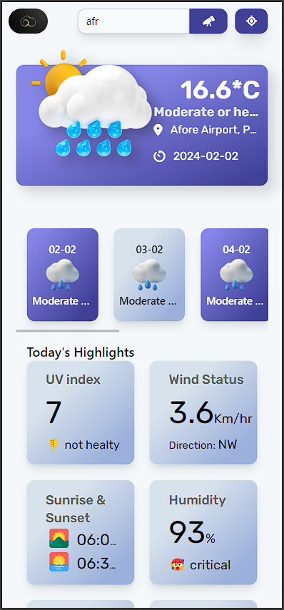
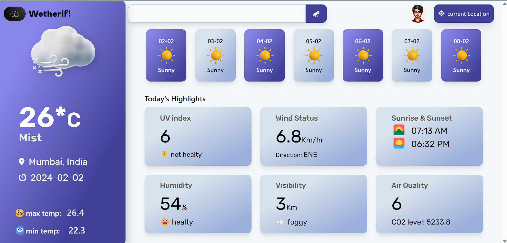

# Weatherif!

Weatherif is a sleek and responsive weather application that provides detailed weather forecasts. Developed using modern web technologies, Weatherif delivers accurate weather information including temperature, UV index, wind status, sunrise and sunset times, humidity, visibility, air quality, and a 3-day temperature forecast.

## Table of Contents

- [Features](#features)
- [Technologies Used](#technologies-used)
- [Setup and Installation](#setup-and-installation)
- [Usage](#usage)
- [Screenshots](#screenshots)
- [Contributing](#contributing)
- [License](#license)
- [Contact](#contact)

## Features

- **Current Weather**: Provides current weather information including temperature, max and min temperature, UV index, and wind status.
- **Sunrise and Sunset**: Displays the times for sunrise and sunset.
- **Humidity and Visibility**: Shows the current humidity levels and visibility range.
- **Air Quality**: Displays the current air quality index.
- **3-Day Forecast**: Provides a temperature forecast for the next 3 days.
- **Responsive Design**: Adapts to different screen sizes for a seamless user experience.

## Technologies Used

- **React**: For building the user interface.
- **Tailwind CSS**: For styling the application.
- **JavaScript**: Core programming language.
- **GSAP (GreenSock Animation Platform)**: For animations and visual effects.
- **WeatherAPI**: For fetching weather data.

## Setup and Installation

### Prerequisites

- Node.js and npm
- Git

### Steps

1. **Clone the repository**

   ```bash
   git clone https://github.com/krish203na/wetherify.git
   cd wetherify
   ```

2. **Install Dependencies**

   ```bash
   npm install
   ```

3. **Create API Key**

   - Sign up on [WeatherAPI](https://www.weatherapi.com/) to get an API key.
   - Create a `.env` file in the root directory and add your API key:
     ```
     REACT_APP_WEATHER_API_KEY=your_api_key_here
     ```

4. **Start the Application**

   ```bash
   npm start
   ```

5. **Access the Application**
   - Open your browser and go to `http://localhost:3000` to access the application.

## Usage

1. **View Current Weather**: Enter a location to get the current weather information.
2. **Check Forecast**: View the temperature forecast for the next 3 days.
3. **Explore Details**: Check detailed weather information including UV index, wind status, sunrise and sunset times, humidity, visibility, and air quality.

## Screenshots

### Mobile version



### Tab version


### Computer version



## Contributing

Contributions are welcome! Please fork the repository and create a pull request with your changes. Ensure your code follows the project's coding standards and includes proper documentation.

## Contact

If you have any questions or suggestions, feel free to reach out to me:

- Email: krishla203@gmail.com
- GitHub: [krish203na](https://github.com/krish203na)
